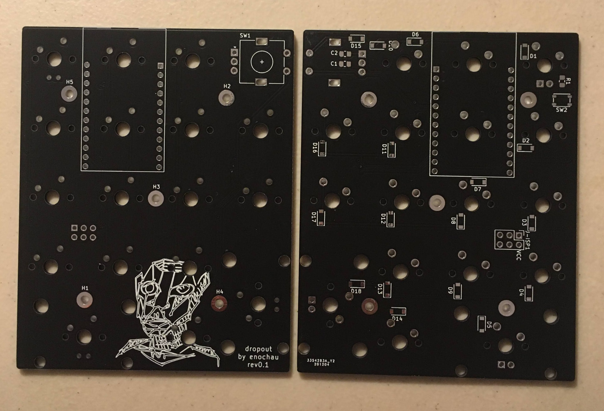
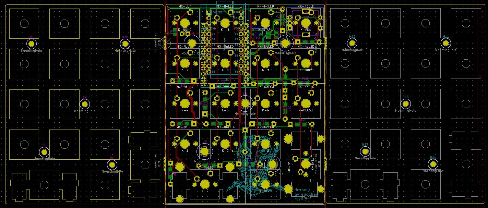

# Dropout 
### (mechanical numpad w/ roatry encoder)

## Firmware
Dropout uses [QMK](https://github.com/qmk/qmk_firmware).
To get the firmware:
1. Clone my qmk fork with `git clone https://github.com/ec965/qmk_firmware.git`.
2. Enter the root directory of the repository with `cd qmk_firmware`.
2. Go to the dropout-numpad branch with `git checkout dropout-numpad`.
3. Compile the rev0.3 firmware by running `qmk compile -kb dropout/rev0.3 -km default`.
4. Flash using either qmk toolbox or the cli.

## Sandwhich Case
Sandwhich! (parts in this order from top down)
*  Plate
*  PCB
*  Bottom Plate

Amount | Part | Dimensions
--- | --- | ---
5 | M2 F-F standoffs | 11mm or 10mm (micro-usb)
10 | M2 screws | 5mm
4 | rubber bumpon feet

rev 0.1

## License
Hardware designs are under the MIT license. QMK is under the GPL v2 license therefore, the firmware is also under the GPLv2 license.

## Updates
PCBs are labelled with revision number in the lower right corner.

12/11 - Rev0.4 Added compatibility for ProMicro with mini-usb or micro-usb on same pcb, flipped orientation of ProMicro, and cleaned up traces.
Added option for switch or rotary encoder. Added I2C header.

12/6 - Rev0.3 Added mouse-bites to print all parts on a single PCB.

12/? - Rev0.2 uses ProMicro (mini-usb). Mounting holes have been moved to prevent interference with stablizier wire. Board outline was also slightly adjusted. I also created a plate pcb. Because some dimensions changed between rev0.1 and rev0.2, the plate will not fit on older revisions.

12/? - Rev0.1 uses ProMicro wiith mini-usb as can be found by various retailers elsewhere on the internet. 
Dimensions for the ProMicro mini-usb are 39.5mm x 23mm. I do not garantee that your ProMicro will fit the board.

12/? - Rev0 uses ProMicro with micro-usb as designed by [Sparkfun](https://www.sparkfun.com/products/12640).

### M2 F-F standoff calculations:
#### For mini-usb
**5mm** _from top of plate to top of pcb_ **- 1.6mm** _thickness of plate_ **+ 1.6mm** _thickness of pcb_ **+ ~5.6mm** _thickness pro-micro usb mini_ **= 10.6mm**
#### For micro-usb
**5mm** _from top of plate to top of pcb_ **- 1.6mm** _thickness of plate_ **+ 1.6mm** _thickness of pcb_ **+ ~4mm** _thickness pro-micro usb mini_ **= 9mm**

## Q&A
Where does the name come from?

I designed this shortly after deciding to dropout.
