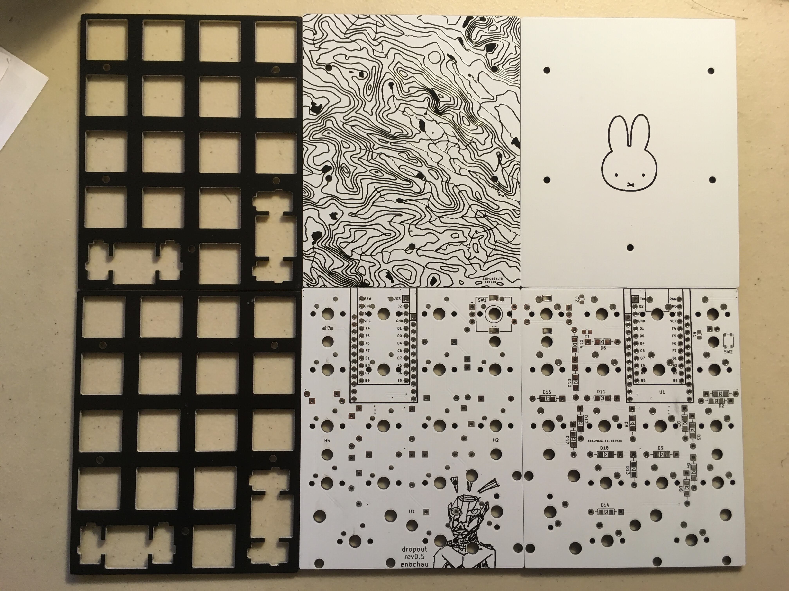

# Dropout 
### (mechanical numpad w/ roatry encoder)

## Firmware
Dropout uses [QMK](https://github.com/qmk/qmk_firmware).
To get the firmware:
1. Setup your QMK enviroment. ([documentation](https://docs.qmk.fm/#/newbs))
2. Move the default qmk repository somewhere else.
1. Return to the home directory that qmk was installed in and clone my qmk fork with `git clone https://github.com/ec965/qmk_firmware.git`.
2. Enter the root directory of the my forked repository with `cd qmk_firmware`.
2. Go to the dropout-numpad branch with `git checkout --track origin/dropout-numpad`.
3. Compile the rev0.3 firmware by running `qmk compile -kb dropout/rev0.3 -km default`.
4. Flash using either [qmk toolbox](https://qmk.fm/toolbox/) (macos or windows) or the cli (linux).

## Parts

### Case Parts
Amount | Part | Dimensions
--- | --- | ---
5 | M2 F-F standoffs | minimum: 13mm (mini usb) or 11mm (micro-usb)
10 | M2 screws | 5mm
4 | rubber bumpon feet

Sandwhich! case (parts in this order from top down)
*  Plate
*  PCB
*  Base

### PCB Components
Amount | Part | Package
--- | --- | ---
17 | diodes (1n4148 recommended) | SOD-123 (SMD) or DO-35 (THT)
1 | resistor (333 Ohms) | 0805
2 | capacitors (10nF) | 0805
1 | led | 1.8mm
1 | rotary encoder | EC-11
1 | push button | SPST PTS810
1 | pro-micro | usb-mini or usb-micro
16 | mx-switches | 
2 | 2U stabilizers | 

#### Notes
* Encoder can be swapped for a 1u switch.
  - If opting for the 1u switch, capacitors are not needed.
* If using encoder, capacitors can be omitted but resulting encoder signal will not be as smooth.
* Resistor can be omitted if num-lock led is not used.

## Pictures
### rev 0.5

### pcb

### rev 0.1

## License
Hardware designs are under the MIT license. QMK is under the GPL v2 license therefore, the firmware is also under the GPLv2 license.

